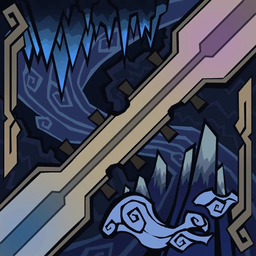
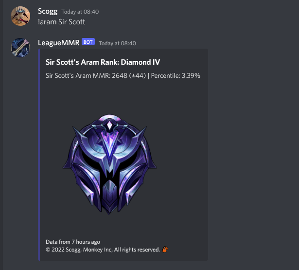
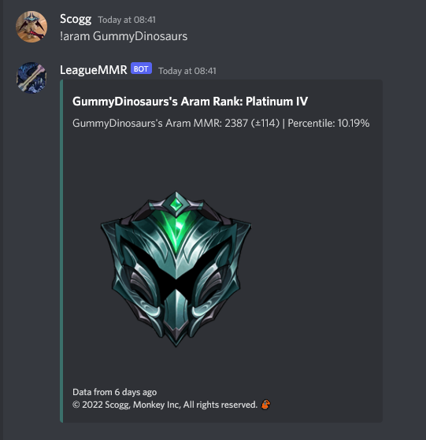

<div align="center">

  
  <h1>LeagueMMRDiscordBot</h1>
  
  <p>
    A League of Legends ARAM MMR Discord Bot
  </p>
</div>

<br />

<!-- Table of Contents -->
# 📔 Table of Contents
- [About the Project](#star2-about-the-project)
  * [Screenshots](#camera-screenshots)
  * [Tech Stack](#space_invader-tech-stack)
  * [Features](#dart-features)
  * [Environment Variables](#key-environment-variables)
- [Getting Started](#toolbox-getting-started)
  * [Prerequisites](#bangbang-prerequisites)
  * [Run Locally](#running-run-locally)
  * [Running Tests](#test_tube-running-tests)
  * [Deployment](#triangular_flag_on_post-deployment)
- [Usage](#eyes-usage)
- [Roadmap](#compass-roadmap)
- [Contributing](#wave-contributing)
  * [Code of Conduct](#scroll-code-of-conduct)
- [FAQ](#grey_question-faq)
- [License](#warning-license)
- [Contact](#handshake-contact)
- [Acknowledgements](#gem-acknowledgements)

  

<!-- About the Project -->
## :star2: About the Project

A League of Legends ARAM MMR Discord Bot which displays your rank and percentile based on your MMR.

❗ Currently only supports EUW accounts. Will expand to other regions in the future.

<!-- Screenshots -->
### :camera: Screenshots

<div align="center"> 
  
  
</div>


<!-- TechStack -->
### :space_invader: Tech Stack

<details>
  <summary>Bot</summary>
  <ul>
    <li><a href="https://nodejs.org/en/">Node.js</a></li>
    <li><a href="https://www.typescriptlang.org/">Typescript</a></li>
  </ul>
</details>

<details>
<summary>DevOps</summary>
  <ul>
    <li><a href="https://www.heroku.com/">Heroku</a></li>
  </ul>
</details>

<!-- Features -->
### :dart: Features

- Fetch the latest ARAM MMR Data for any specified profile
- Display an overview of your current MMR, rank and percentile

<!-- Env Variables -->
### :key: Environment Variables

To run this project, you will need to add the following environment variables to your .env file

`BOT_TOKEN` - The bot's secret token obtained from Discord Developer Portal

`BOT_OWNER_ID` - The ID of the owner of the bot

`PREFIX` - The prefix at the beginning of every command

<!-- Getting Started -->
## 	:toolbox: Getting Started

<!-- Prerequisites -->
### :bangbang: Prerequisites
   
    - Node.js
    - NPM
    - TypeScript

<!-- Run Locally -->
### :running: Run Locally

Clone the project

```bash
  git clone https://github.com/Scottd125/LeagueMMRDiscordBot.git
```

Go to the project directory

```bash
  cd LeagueMMRDiscordBot
```

Install dependencies

```bash
  npm install
```

Start the server

```bash
  npm run start
```

<!-- Running Tests -->
### :test_tube: Running Tests

WIP

<!-- Deployment -->
### :triangular_flag_on_post: Deployment

<!-- TODO -->
WIP

<!-- Usage -->
## :eyes: Usage

Utilize the 'aram' command by typing your prefix followed by aram and your League username

(E.g. !aram Sir Scoot)

<div align="center"> 
  
</div>

<!-- Roadmap -->
## :compass: Roadmap

<!-- TODO -->
WIP

<!-- Contributing -->
## :wave: Contributing

<a href="https://github.com/Scottd125/LeagueMMRDiscordBot/graphs/contributors">
  
</a>

Contributions are always welcome!

<!-- TODO -->
<!-- See `contributing.md` for ways to get started. -->


<!-- Code of Conduct -->
### :scroll: Code of Conduct

<!-- TODO -->
WIP
<!-- Please read the [Code of Conduct](https://github.com/Scottd125/LeagueMMRDiscordBot/blob/master/CODE_OF_CONDUCT.md) -->

<!-- FAQ -->
## :grey_question: FAQ

<!-- TODO -->
WIP

<!-- License -->
## :warning: License

Distributed under the GNU General Public License v3.0. See LICENSE for more information.

<!-- Contact -->
## :handshake: Contact

<!-- TODO -->
WIP

<!-- Acknowledgments -->
## :gem: Acknowledgements

Use this section to mention useful resources and libraries that you have used in your projects.

 - [Discord.js](https://discord.js.org/#/)
 - [WhatIsMyMMR](https://dev.whatismymmr.com/)
 - [Moment](https://momentjs.com/)
